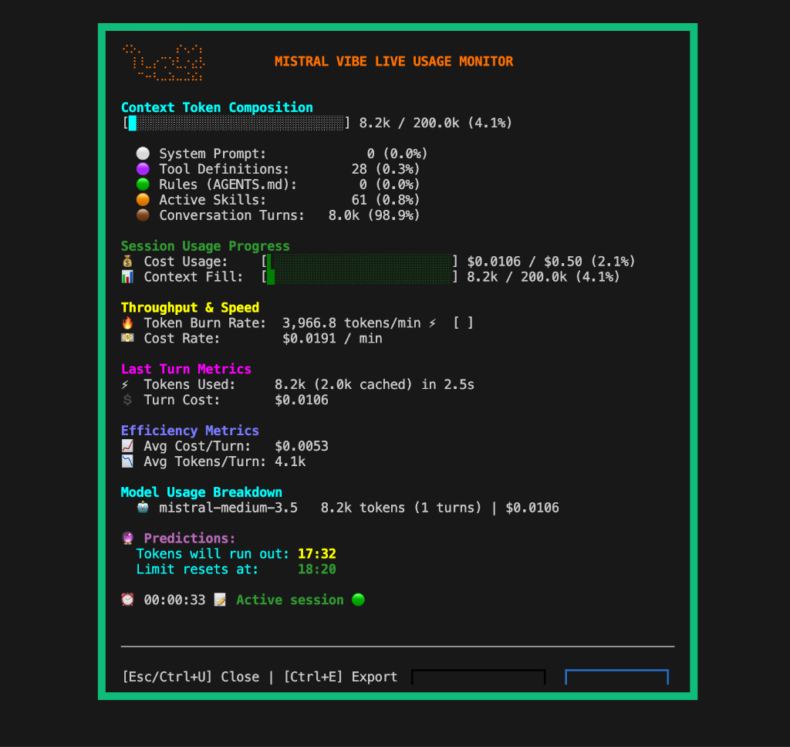
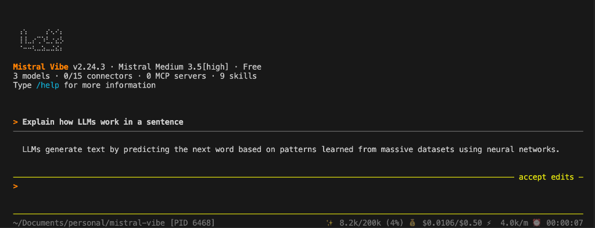

# TokenPulse — Mistral Vibe Live Usage Monitor & Telemetry Observatory

TokenPulse is a real-time observability engine and live telemetry dashboard built for **Mistral Vibe**. It gives developers complete transparency into context window occupancy, API token consumption, execution throughput, and financial spending during autonomous AI coding sessions.

---

## Overview

When running long-running or autonomous coding tasks, context windows can quickly fill up with tool definitions, system prompts, active skills, and conversation turns. Without visibility, developers risk sudden context truncation, rate limit exhaustion, or unexpected API spending.

**TokenPulse** solves this problem by providing a live, real-time telemetry overlay that breaks down token distribution, calculates real-time burn rates, predicts when limits will be reached, and tracks execution efficiency.

---

## Main Features

### 1. Interactive Observatory Dashboard (`Ctrl+U`)
Press `Ctrl+U` at any point during a Vibe session to trigger the full-screen modal observatory dashboard. Featuring Mistral's signature animated orange braille cat mascot (**PetitChat**), the dashboard provides instant visual insights into session health.

### 2. Context Token Composition Breakdown
Visualizes how context window tokens are consumed across five distinct categories:
- **System Prompt**: Core instructions and system framing.
- **Tool Definitions**: Schema overhead from available tools.
- **Rules (`AGENTS.md`)**: Project-level agent rules and style directives.
- **Active Skills**: Prompt memory loaded from custom and built-in skills.
- **Conversation Turns**: Active chat history and user/assistant messages.

### 3. Session Usage & Budget Progress
Dual progress bars track real-time consumption against session caps:
- **Cost Usage**: Live spending versus configured maximum price cap (`--max-price`).
- **Context Fill**: Total prompt and completion tokens versus maximum model window size (e.g., 200k tokens).

### 4. Throughput & Speed Metrics
Calculates dynamic execution performance:
- **Token Burn Rate**: Rolling tokens per minute (`tokens/min`).
- **Cost Rate**: Financial burn rate per minute (`$/min`).

### 5. Last Turn & Efficiency Metrics
- **Last Turn Metrics**: Tokens consumed (including discounted prompt-cached tokens) and turn duration in seconds.
- **Efficiency Metrics**: Average cost per turn (`$/turn`) and average tokens per turn (`tokens/turn`).

### 6. Model Breakdown & Predictive Analytics
- **Model Usage Breakdown**: Per-model accounting of token count, turn count, and financial cost.
- **Predictive Session Exhaustion**: Calculates exact timestamps for when context tokens will run out and when rate limits reset based on current burn rate.

### 7. Integrated CLI Status Bar
TokenPulse integrates directly into the main Vibe terminal status bar, displaying real-time token count, window fill percentage, spending versus cap, throughput speed, and elapsed session time at a glance.

### 8. One-Key Structured JSON Telemetry Export (`Ctrl+E`)
Press `Ctrl+E` inside the dashboard to export a complete, audit-ready structured JSON report to `~/.vibe/reports/agent_observatory_report_*.json`.

---

## Keyboard Shortcuts

| Shortcut | Action |
| --- | --- |
| `Ctrl+U` | Toggle Live Usage Monitor Dashboard |
| `Ctrl+E` | Export Structured JSON Telemetry Report |
| `Esc` / `q` | Close Dashboard |

---

## Architecture & Implementation

TokenPulse is implemented across three core layers:

1. **Observability Metrics Engine** (`vibe/core/observability_metrics.py`):
   Pure, deterministic metric calculators for burn rates, context composition ratios, limiting resources, and session runway forecasts.

2. **Agent Loop Instrumentation** (`vibe/core/agent_loop/_loop.py` & `types.py`):
   Non-blocking event tracking that captures prompt history, cached token discounts, tool execution counts, and file modification metrics across turns.

3. **Textual TUI Modal Surface** (`vibe/cli/textual_ui/screens/usage_monitor_screen.py` & `app.tcss`):
   A multi-layered Textual screen featuring animated braille rendering, custom TCSS grid styling, and responsive layout algorithms.
